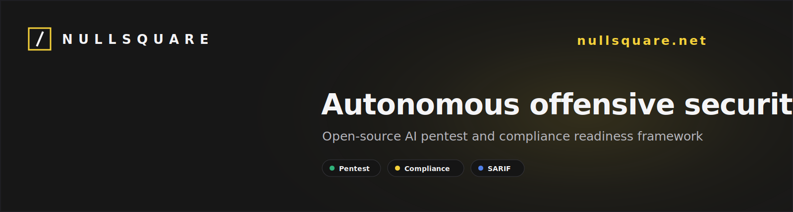
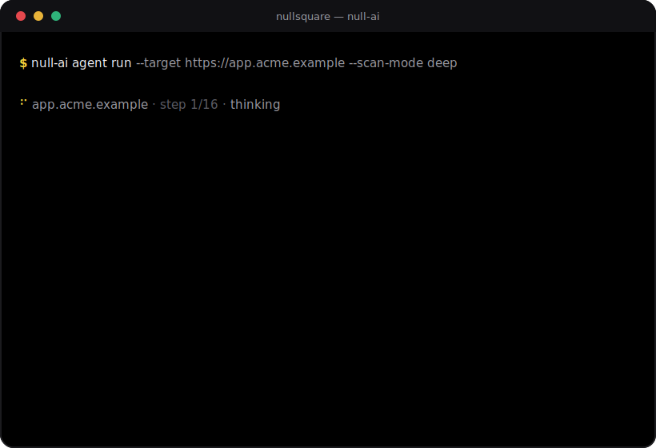

<div align="center">



# Null AI CLI

**Open-source AI-assisted pentest & compliance-readiness framework — by [NullSquare](https://nullsquare.net).**

[](https://github.com/Null-Square/Null-CLi/actions/workflows/ci.yml)
[](https://github.com/Null-Square/Null-CLi/stargazers)
[](LICENSE)
[](package.json)
[](tsconfig.json)
[](sandbox/Dockerfile)
[](src/reports/sarif.ts)
[](CONTRIBUTING.md)
[](https://nullsquare.net)

[](#quick-start)
[](https://nullsquare.net)
[](#quick-start)
[](docs/compliance.md)
[](docs/compliance.md)
[](docs/compliance.md)
[](docs/compliance.md)

A scoped terminal agent for authorized testing: run safe reconnaissance, orchestrate common scanners, ingest artifacts, produce evidence-backed findings, and map them to lightweight compliance-readiness controls.

**Framework tags:** AI pentest agent · offensive security testing · scanner orchestration · evidence capture · SARIF · OWASP Top 10 · PCI DSS lite · ISO 27001 lite · NIST CSF lite · Docker sandbox · TypeScript CLI



</div>

## Why Null AI CLI

Modern teams need security feedback that is faster than a traditional pentest and more useful than raw scanner output. Null AI CLI is the open-source layer: a reproducible command-line framework for local assessments, scanner normalization, evidence capture, reports, and readiness mapping.

It is intentionally separate from the NullSquare managed platform — the public repo is useful on its own while keeping managed-platform internals out of scope. For hosted sandboxes, team workflows, dashboards, continuous testing, and enterprise reporting, see **[nullsquare.net](https://nullsquare.net)**.

## Install

```bash
# Run instantly with npx (no install)
npx @nullsquare/null-cli --help

# Or install globally
npm install -g @nullsquare/null-cli
null-ai --help

# Or one-line installer (checks Node >= 20, installs globally)
curl -fsSL https://raw.githubusercontent.com/Null-Square/Null-CLi/main/scripts/install.sh | bash
```

<details>
<summary>Build from source</summary>

```bash
git clone https://github.com/Null-Square/Null-CLi.git
cd Null-CLi
npm install
npm run build
node dist/cli/index.js --help
```

</details>

Binaries after install: `null-ai`, `null`, `nullsquare` (all identical).

## Quick Start

```bash
# 1. Offline dry-run — builds the assessment structure, no model call, no key needed
null-ai agent run --target https://example.com --dry-run --out .null/example

# 2. Live assessment — set an OpenAI-compatible key first
export NULL_AI_API_KEY="your-api-key"
export NULL_AI_MODEL="gpt-4.1-mini"

null-ai agent run \
  --target https://example.com \
  --goal "Scoped web assessment with compliance-readiness mapping" \
  --scan-mode deep \
  --framework pci-dss-lite \
  --out .null/example
```

> **Only test systems you own or are explicitly authorized to test.** Scanner and shell execution are **off by default**; enable them with `--allow-shell` only for in-scope assets.

## Key Capabilities

- **Scoped single-agent loop** — one safe action per turn, hard scope boundaries, evidence-first reporting.
- **Scan modes** — `--scan-mode quick | standard | deep` trade speed for coverage.
- **Multi-target** — repeat `--target` to assess several assets in one command.
- **Live terminal UX** — branded NullSquare panels with real-time step, tool, and finding output.
- **Scanner ingestion** — normalize `nuclei`, `semgrep`, and `trivy` JSON/JSONL into unified findings.
- **Engineer-ready outputs** — Markdown reports and SARIF for code scanning / CI.
- **Compliance readiness** — map findings to `owasp-top10`, `pci-dss-lite`, `iso27001-lite`, `nist-csf-lite`.
- **Docker sandbox** — reproducible scanner runtime with a toolchain smoke test.
- **Public skill packs** — markdown skills for scan modes, tooling, vuln classes, and compliance.

## Toolkit

| Tool | Purpose |
|------|---------|
| `http_request` | Safe HTTP capture and endpoint checks |
| `browser_action` | Browser-like page capture for surface mapping |
| `scanner_run` | Orchestrate scanners (gated behind `--allow-shell`) |
| `attach_evidence` | Attach raw artifacts to the assessment |
| `report_finding` | Draft evidence-backed findings with severity, CWE, OWASP, CVSS |
| `map_compliance` | Map findings to a readiness framework |
| `file_read` | Read local target sources within scope |

## Vulnerability Coverage

| Category | Examples |
|----------|----------|
| Access Control | IDOR, missing authorization, auth bypass |
| Misconfiguration | Missing security headers, verbose banners, exposed services |
| Client-Side | Reflected / stored XSS |
| Transport & Session | Missing HSTS, insecure cookies |
| Disclosure | Sensitive data / error leakage |

> Deep validation, exploit-chaining, and advanced heuristics live only in the managed NullSquare platform — this OSS layer focuses on safe, evidence-backed discovery.

## Scan Modes

| Mode | Steps | Use when |
|------|-------|----------|
| `quick` | ~4 | Fast scoped review of a single target |
| `standard` | ~8 | Repeatable assessment (default) |
| `deep` | ~16 | Broader coverage with fuller evidence & compliance mapping |

Each mode is backed by a public skill (`null-ai skills show scan-mode-deep`) that shapes the agent's plan.

## Outputs

Each assessment writes deterministic local artifacts:

```text
.null/example/
  run-state.json        # full assessment state
  findings.json         # normalized findings
  findings.sarif        # SARIF 2.1.0 for CI / code scanning
  reports/report.md     # human-readable report
  artifacts/            # captured evidence
```

## Scanner Ingestion & Reports

```bash
# Normalize scanner output into Null AI findings
null-ai ingest artifacts/scans --out findings.json

# Generate a report + SARIF
null-ai report generate findings.json --out report.md --sarif findings.sarif --framework iso27001-lite

# Map findings to compliance-readiness controls
null-ai compliance map findings.json --framework pci-dss-lite --out pci-readiness.json
```

Compliance output is readiness support — **not** certification, attestation, or legal advice.

## Sandbox Runtime

```bash
docker build -f sandbox/Dockerfile -t null-cli-sandbox:dev .
docker run --rm -v "$PWD/sandbox:/opt/null-cli/sandbox:ro" null-cli-sandbox:dev \
  sh /opt/null-cli/sandbox/smoke.sh /opt/null-cli/sandbox/tools-manifest.json
```

Covers `httpx`, `nuclei`, `katana`, `nmap`, `semgrep`, `trivy`, `gitleaks`, `curl`, `jq`, and `node`.

## CI Usage

```yaml
- name: Null AI CLI dry assessment
  run: |
    npm ci && npm run build
    node dist/cli/index.js agent run --target https://example.com --dry-run --out .null/ci
```

For live assessments, provide `NULL_AI_API_KEY` and keep targets limited to systems you are authorized to test.

## Public Boundary

This repo ships the **open-source framework layer**: CLI + branded terminal, scoped public agent loop, scanner runtime checks, artifact ingestion, evidence-backed findings, reports/SARIF, lightweight compliance mapping, and public skill packs.

It does **not** include NullSquare managed-platform internals, customer artifacts, non-public heuristics, multi-agent orchestration, cross-run memory, hosted service logic, or enterprise automation. See [docs/public-boundary.md](docs/public-boundary.md).

## NullSquare Platform

Null AI CLI is the open-source entry point. **[NullSquare](https://nullsquare.net)** is the managed platform for teams that need hosted assessments, managed infrastructure, collaboration, dashboards, evidence review, compliance workflows, and enterprise reporting.

## Safety

Use Null AI CLI only on systems you own or have explicit permission to test. Keep written authorization, define scope before scanning, and never use it for destructive activity or credential attacks.

## Documentation

- [Architecture](docs/architecture.md) · [CLI reference](docs/cli.md) · [Scan modes](docs/scan-modes.md) · [Compliance](docs/compliance.md) · [Public boundary](docs/public-boundary.md)

## Contributing

Contributions that keep the public boundary intact are very welcome — new scanner parsers, public skills, report improvements, and tests. See [CONTRIBUTING.md](CONTRIBUTING.md) and [SECURITY.md](SECURITY.md).

## License

[Apache-2.0](LICENSE).
