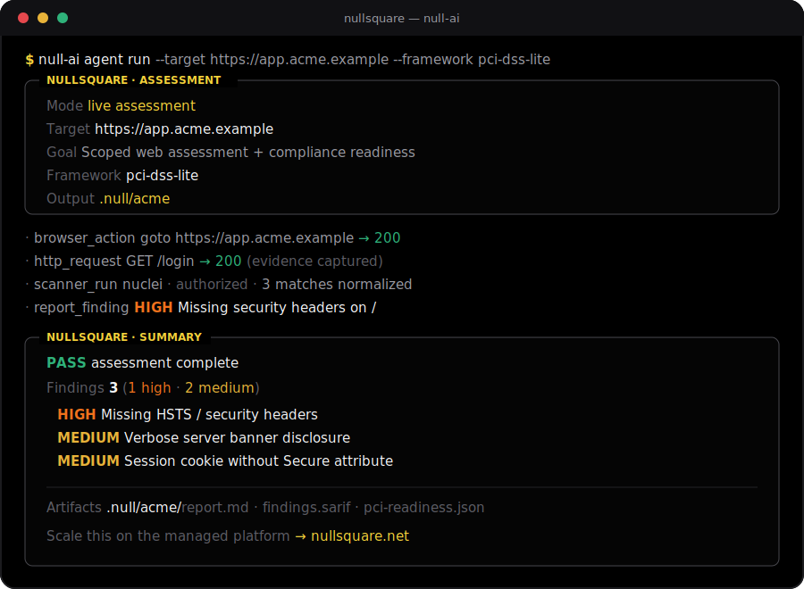

# Architecture



Null CLI is intentionally small.

```text
CLI command
  -> public agent loop
  -> scoped tool registry
  -> workspace artifacts
  -> findings/report/compliance outputs
```

The agent loop asks an OpenAI-compatible model for one JSON action at a time. The model can call only registered public tools. Tool results are returned to the model as text, and final artifacts are written locally.

The loop emits typed events (`step`, `tool`, `finding`, `note`, `done`) that the CLI renders as a live, branded status line while the run is in progress. The chosen scan mode sets the step budget and injects the matching public skill as planning guidance.

The public implementation does not contain managed-platform orchestration, enterprise validation workflows, cross-run memory, multi-agent topology, customer artifact review systems, or non-public prompt paths.

## Main Modules

- `src/agent`: shallow JSON-action loop, scan modes, typed run events, and public system prompt.
- `src/cli`: argument parsing, NullSquare brand/panels (`brand.ts`), and the live reporter (`live.ts`).
- `src/tools`: scoped public tools.
- `src/scanners`: scanner artifact parsers.
- `src/findings`: public finding and evidence types.
- `src/reports`: Markdown and SARIF rendering.
- `src/compliance`: readiness mapping.
- `skills`: public markdown skills (scan modes, tooling, vuln classes, compliance).
- `sandbox`: public tool manifest and container helpers.
